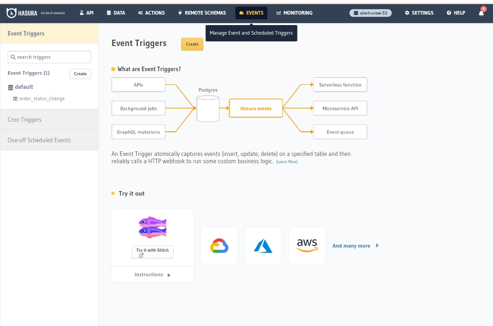
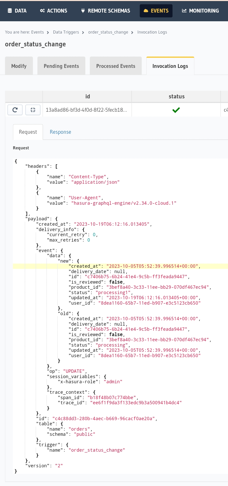
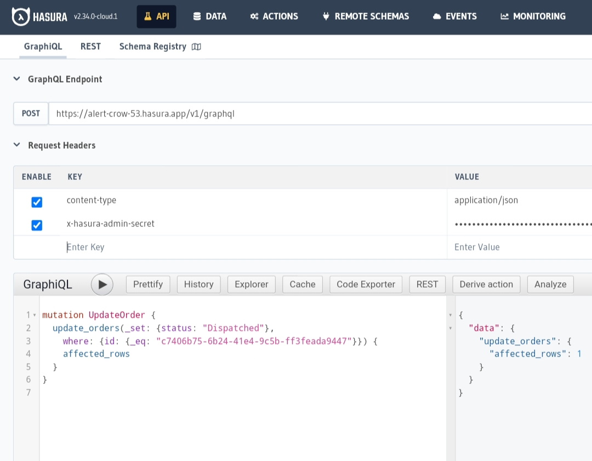
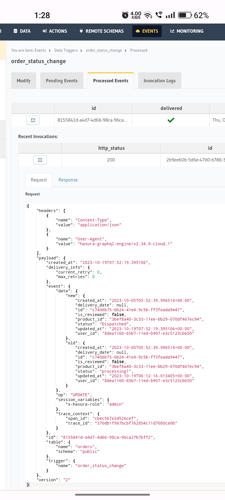
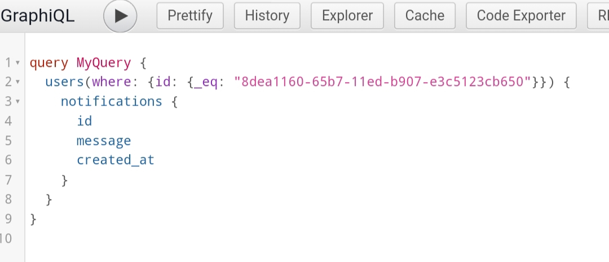
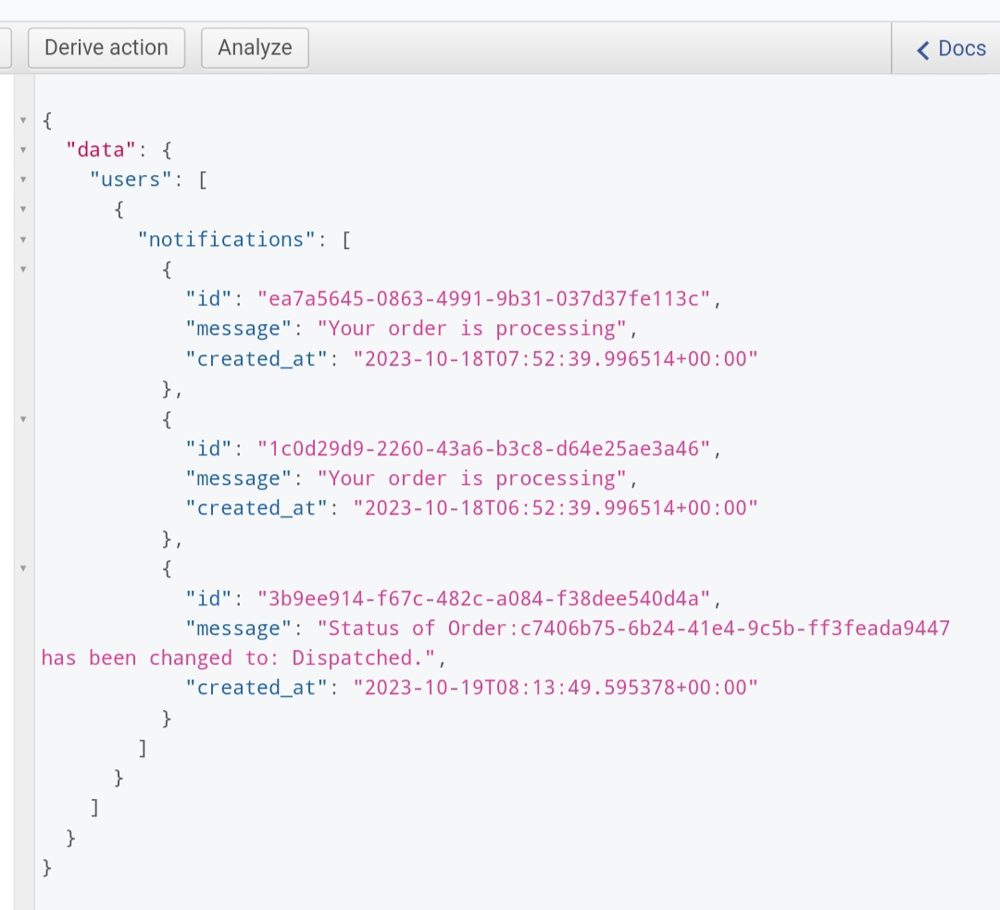

# Send a Notification when Order Status Changes

## Introduction
Using Event Triggers allows you to call a webhook with a contextual payload whenever a specific event occurs in your database. 
In this recipe, we'll create an Event Trigger that will fire whenever status of order changes. We'll then send a notification to that user.

> **_NOTE:_** This quickstart/recipe is dependent upon the docs e-commerce sample app. If you haven't already deployed the sample app, you can do so with one click below. 
> If you've already deployed the sample app, simply use [your existing project](https://cloud.hasura.io/).

## Prerequisites
Before getting started, ensure that you have the following in place:
* The docs e-commerce sample app deployed to Hasura Cloud.

## Our model
Event Triggers are designed to run when specific operations occur on a table, such as insertions, updates, and deletions. When architecting your own Event Trigger, you need to consider the following:

* Which table's changes will initiate the Event Trigger?
* Which operation(s) on that table will initiate the Event Trigger?
* What should my webhook do with the data it receives?

# Step 1: Create the Event Trigger

Head to the `Events` tab of the Hasura Console and click `Create`:



# Step 2: Configure the Event Trigger

First, provide a name for your trigger, e.g., `order_status_change`. Choose the `public` schema and the `orders` table. 
Then, select the `update` operation under Trigger Operations.
Then, select the `status` column under `Listen columns for update`.

Finally, enter a webhook URL that will be called when the event is triggered. This webhook will be responsible for parsing the body of the request and sending the email to the new user; it can be hosted anywhere, and written in any language you like.

The route on our webhook we'll use is /status-change. Below, we'll see what this looks like with a service like ngrok, but the format will follow this template:

`https://<your-webhook-url>/status-change`


> **_NOTE_**: TUNNELING YOUR WEBHOOK ENDPOINT
> Since our project is running on Hasura Cloud, and our handler will run on our local machine, we'll use ngrok to expose the webhook endpoint to the internet. This will allow us to expose a public URL that will forward requests to our local machine and the server we'll configure below.
> You'll need to modify your webhook URL to use the public URL provided by ngrok.
> After installing ngrok and authenticating, you can do this by running:
> `ngrok http 4000`
> Then, copy the Forwarding value for use in our webhook

Under Advanced Settings, we can configure the headers that will be sent with the request. We'll add an authentication header to prevent abuse of the endpoint and ensure that only Hasura can trigger the event. Set the Key as secret-authorization-string and the Value as super_secret_string_123

Before exiting, open the Add Request Options Transform section and check POST. Then, click Create Event Trigger.

## Step 3: Create a webhook to handle the request
Whenever a status is changed in `orders` table, the Event Trigger fires. Hasura will send a request to the webhook URL you provided. In this example, we're simply going to send a POST request. Our webhook will parse the request, ensure the header is correct, and then see a notification.

Event Triggers sent by Hasura to your webhook as a request include a payload with event data nested inside the body object of the request. This event object can then be parsed and values extracted from it to be used in your webhook:



Below, we've written an example of webhook. As we established earlier, this runs on port 4000. If you're attempting to run this locally, follow the instructions below. If you're running this in a hosted environment, use this code as a guide to write your own webhook

```
app.post('/status-change', async (req, res) => {
  ...
  // parse the status from the event payload
  const orderStatus = req.body.event.data.new.status;
  const orderId = req.body.event.data.new.id;
  const userId = req.body.event.data.new.user_id;
  
  // send notification to user
  await sendNotification(userId, orderId, orderStatus);

  // send some JSON to the client
  res.json({
    orderId: orderId,
    orderStatus: orderStatus
  });
});
```

## Step 4: Test the setup
With your server running, Hasura should be able to hit the endpoint. We can test this by updating a `status` in `orders` table. Let's do this with the following mutation from the API tab of the Console.
```
mutation UpdateOrder {
  update_orders(_set: {status: "Dispatched"}, 
    where: {id: {_eq: "c7406b75-6b24-41e4-9c5b-ff3feada9447"}}) {
    affected_rows
  }
}
```



We can then see processed event in Events tab-



We'll then see notification for that user.




Feel free to customize the webhook implementation based on your specific requirements. Remember to handle error scenarios, implement necessary validations, and add appropriate security measures to your webhook endpoint.
